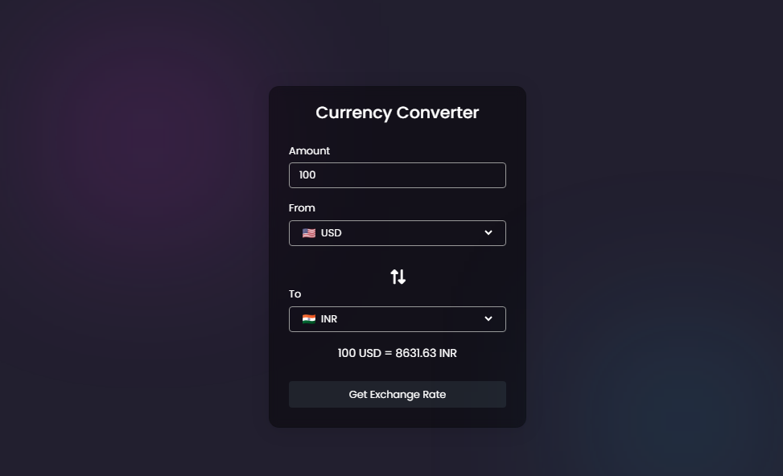

# Currency Converter Application

This is a simple web-based currency converter application that allows users to convert amounts between various currencies. It dynamically fetches exchange rates and displays the equivalent amount in the selected currency.

## Features
- Convert currencies using real-time exchange rates.
- Support for multiple currencies with corresponding flags.
- Swap functionality to reverse the selected currencies.

## Technologies Used
- **HTML**: Structure of the web page.
- **CSS**: Styling for a modern and clean user interface.
- **JavaScript**: Fetching exchange rates and dynamic functionality.
- **Exchange Rate API**: Fetching live exchange rates.

## Getting Started

### Prerequisites
- A modern web browser.
- API key from [ExchangeRate-API](https://www.exchangerate-api.com/).

### Installation
1. Clone the repository or download the source code.
   ```bash
   git clone https://github.com/kshitijhadke26/Currency-Converter.git
   ```
2. Replace `YOUR_API_KEY` in the JavaScript file (`index.js`) with your actual API key.
3. Open the `index.html` file in a browser to use the application.

### File Structure
```
project-folder/
├── index.html       # Main HTML file
├── style.css        # Styling for the application
├── index.js         # JavaScript for functionality
├── countries.js     # List of supported currencies and their flags
```

## How to Use
1. Open the application in a web browser.
2. Enter the amount you want to convert.
3. Select the currencies from the dropdown menus ("From" and "To").
4. Click the "Get Exchange Rate" button to view the converted amount.
5. Use the swap icon to reverse the selected currencies.

## Screenshots


## Acknowledgments
- [ExchangeRate-API](https://www.exchangerate-api.com/) for providing real-time exchange rates.
- [FlagCDN](https://flagcdn.com/) for country flag images.
